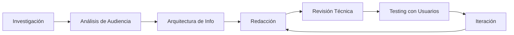

# 👋 ¡Hola! Soy María Nadal

<div align="center">

### ✍️ Technical Writer | Especialista en Negocios | Comunicadora

*Transformando código complejo en documentación clara que impulsa resultados*

[](https://www.linkedin.com/in/maria-nadal-399176232)
[]()
[]()

</div>

---

## 🎯 Mi Propósito

Soy una apasionada de la tecnología con formación en **Comunicación para el Desarrollo** y **Maestría en Negocios**. Mi misión es **eliminar las barreras del lenguaje técnico** para que el software sea accesible, usable y rentable.

> *"La buena documentación no solo explica cómo funciona algo, explica por qué es importante para el éxito del usuario."*

---

## 💼 Lo Que Hago

### 📚 Especialidades
- **Documentación de APIs**: Guías de integración, referencias de endpoints, ejemplos de código
- **Manuales de Usuario**: Tutoriales paso a paso, FAQs, troubleshooting guides
- **Documentación de Producto**: Release notes, feature specifications, user journeys
- **Estrategia de Contenido**: Information architecture, content audits, style guides

### 🎨 Mi Enfoque
```
Código Técnico → Traducción Clara → Valor de Negocio
```

**¿Por qué es diferente?**
- ✅ Combino conocimiento técnico con perspectiva de negocios
- ✅ Escribo pensando en usuarios reales, no solo en desarrolladores
- ✅ Mido el impacto: menos tickets de soporte = documentación exitosa

---

## 🛠️ Herramientas y Tecnologías

**Lenguajes de Marcado**
- Markdown (experta)
- HTML/CSS
- ReStructuredText

**Plataformas**
- GitHub / GitLab
- ReadTheDocs
- Confluence / Notion

**Metodología**
- Docs-as-Code
- Plain Language
- Information Architecture

---

## 📂 Proyectos Destacados

### 🔹 [Documentación TechFlow](https://github.com/nadalm344/Documentacion-TechFlow)
Guía completa de instalación y requisitos técnicos para software empresarial
- ✨ Estructura modular escalable
- 🎯 Orientada a diferentes roles (admins, devs, usuarios finales)

### 🔹 [Protocolo de Seguridad para Trabajo Remoto](https://github.com/nadalm344/PROTOCOLO-DE-SEGURIDAD-PARA-EL-TRABAJO-REMOTO)
Manual de políticas de seguridad con enfoque práctico
- 🔒 Balance entre seguridad y usabilidad
- 📋 Checklists accionables

### 🔹 [Auditoría Técnica PokeAPI](https://github.com/nadalm344/guia-tecnica-pokeapi)
Análisis de seguridad y usabilidad en integración de APIs públicas
- 🔍 Evaluación crítica de documentación existente
- 💡 Recomendaciones de mejora

### 🔹 [Manuales Técnicos - Mercado Pago](https://github.com/nadalm344/Manuales-Tecnicos-)
Documentación de producto fintech accesible para usuarios no técnicos
- 💳 Simplificación de conceptos financieros complejos
- 👥 Lenguaje inclusivo y claro

---

## 🎓 Formación

**Maestría en Informática**  
Enfoque en gestión de proyectos tecnológicos

**Posgrado en Comunicación y Plataformas Multimedios**  
Especialización en narrativas digitales y UX Writing

**Comunicación para el Desarrollo**  
Base en comunicación estratégica y diseño de mensajes efectivos

---

## 📈 Mi Enfoque de Trabajo



**Principios que guían mi trabajo:**
1. **Usuario primero**: La documentación existe para resolver problemas reales
2. **Claridad sobre complejidad**: Si necesita explicación, necesita simplificación
3. **Medición de impacto**: Las métricas guían la mejora continua
4. **Colaboración**: La mejor documentación nace del trabajo en equipo

---

## 🌱 Actualmente Aprendiendo

- 🔧 Documentación de APIs con OpenAPI/Swagger
- 🤖 Integración de AI en flujos de documentación
- 📊 Analytics para documentación (feedback loops)
- 🎨 Design systems y component libraries

---

## 💬 Hablemos

¿Necesitas documentación que realmente funcione? ¿Tienes un proyecto donde la claridad es crítica?

- 📧 **Conecta conmigo en** [LinkedIn](https://www.linkedin.com/in/maria-nadal-399176232)
- 💼 **Explora mis proyectos** aquí en GitHub
- 🗣️ **Intereses de colaboración**: Open source docs, fintech, edtech, healthtech

---

<div align="center">

### ⭐ Si encuentras valor en mi trabajo, considera dejar una estrella en mis repositorios

**"Documentation is a love letter that you write to your future self."** - Damian Conway

---

*Última actualización: Diciembre 2025*

</div>
